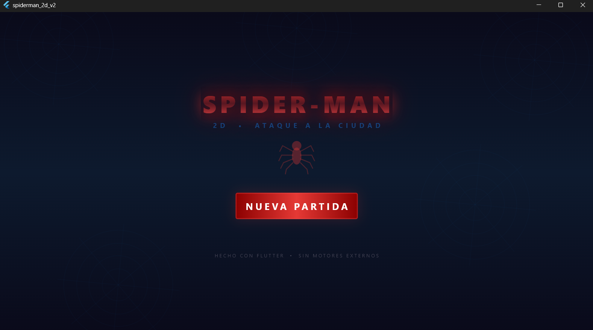
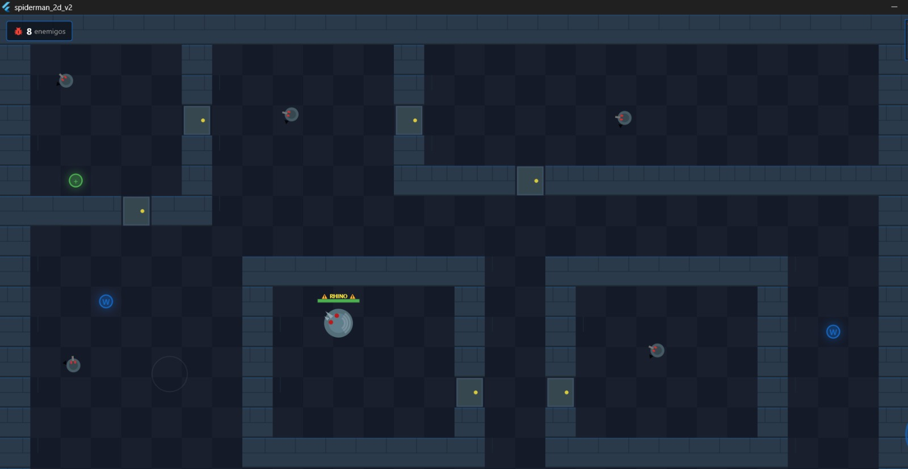
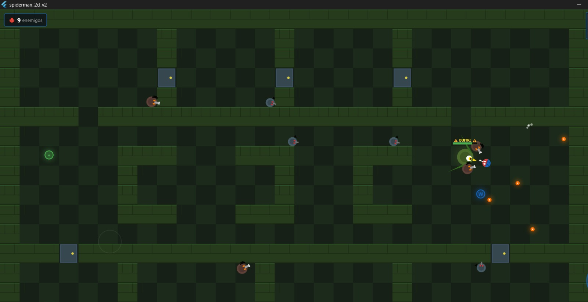
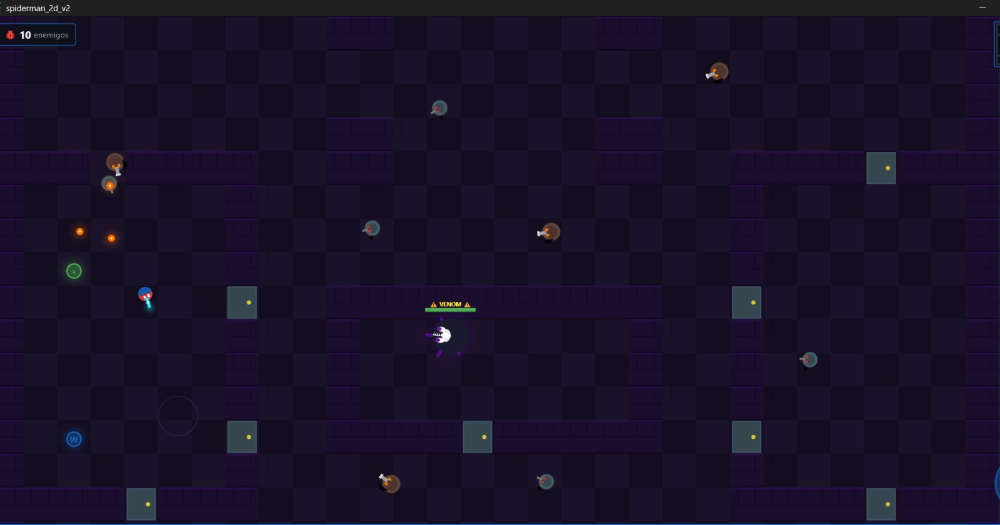
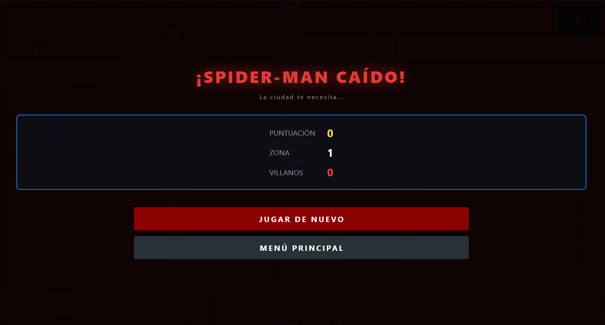

# 🕷️ Spider-Man 2D — Ataque a la Ciudad

Un videojuego **Shooter Top-Down 2D** inspirado en Spider-Man, desarrollado completamente con **Flutter y Dart puro** sin motores de juego externos. Todo el renderizado es procedural usando `CustomPainter` y `Canvas` de Flutter.

> **Curso:** Desarrollo de Aplicaciones Móviles Avanzadas (Flutter & Dart)  
> **Restricción:** Sin motores externos (no Flame, no Unity). Solo Flutter SDK.

---

## 📸 Capturas de Pantalla

| Menú Principal | Zona 1 — Tejado del Daily Bugle |
|:-:|:-:|
|  |  |

| Zona 2 — Torre Oscorp | Zona 3 — Guarida de Venom |
|:-:|:-:|
|  |  |

| Pantalla de Game Over |
|:-:|
|  |

---

## 🎮 Características

- **Vista top-down 2D** con sprites procedurales — sin imágenes externas (.png/.jpg)
- **Spider-Man** jugable con traje rojo/azul, telaraña en el torso y lentes blancos
- **3 tipos de enemigos comunes:**
  - 🔫 **Ladrón con pistola** — rápido, disparo individual
  - 💥 **Ladrón con escopeta** — más robusto, disparo en spread de 3
- **3 jefes únicos por nivel:**
  - 🦏 **RHINO** (Zona 1) — tanque melee, enorme vida, carga directa al jugador
  - 🦅 **BUITRE** (Zona 2) — vuela, dispara abanico de 5 plumas
  - 🖤 **VENOM** (Zona 3) — tentáculos animados, disparo simbionte + melee combinado
- **3 armas diferenciadas visualmente y en mecánica:**
  - 🤍 **Lanzarredes** — disparo único, munición infinita, daño 20
  - 🔵 **Explosión de Redes** — 5 proyectiles spread, daño 9 c/u
  - 🩵 **Red de Impacto** — proyectil grande cyan, daño 40, velocidad 1.6×
- **3 zonas** con dificultad, estética y paleta de color distintas
- **Controles táctiles**: joystick flotante libre + botones de acción
- **HUD completo**: vida, arma activa con ícono, munición, puntuación, minimapa
- **Efectos visuales**: partículas, flash de daño rojo, glow en proyectiles
- **Sistema de colisiones AABB/Círculo** implementado desde cero
- **Puertas** que se abren automáticamente al acercarse
- **Armas especiales** con aparición aleatoria en cada partida

---

## 📋 Requisitos Previos

1. **Flutter SDK 3.0+** — [flutter.dev/docs/get-started/install](https://flutter.dev/docs/get-started/install)
2. **Android Studio** (para emulador) o dispositivo Android físico
3. **Git** para clonar el repositorio

---

## 🚀 Instalación y Ejecución

```bash
# 1. Clonar el repositorio
git clone https://github.com/DanMox-24/Spider-Man2D.git
cd spiderman_2d

# 2. Instalar dependencias (solo Flutter SDK, sin paquetes externos)
flutter pub get

# 3. Verificar que el entorno esté configurado
flutter doctor

# 4. Ejecutar en modo debug (emulador o dispositivo conectado)
flutter run

# 5. Compilar APK release para instalar en dispositivo físico
flutter build apk --release
```

El APK release se genera en:
```
build/app/outputs/flutter-apk/app-release.apk
```

---

## 📱 Controles

| Control | Acción |
|---------|--------|
| **Toca el lado izquierdo de la pantalla** | Aparece el joystick flotante — mueve a Spider-Man |
| **Botón azul (derecha)** | Disparar telaraña — mantener para disparo continuo |
| **Botón naranja (derecha)** | Cambiar arma activa |

> El joystick es **libre y flotante**: aparece donde el jugador toca, sin posición fija.

---

## 🎯 Cómo Jugar

1. Presiona **NUEVA PARTIDA** en el menú principal
2. **Elimina todos los villanos** de la zona — el contador aparece en la esquina superior izquierda
3. La **salida** (símbolo de telaraña verde) se activa al derrotar a todos los enemigos
4. Camina sobre la salida para avanzar a la siguiente zona
5. Recoge **vida `+`** y **munición `W`** en el camino
6. Los **pickups de arma** aparecen aleatoriamente como `ER` (Explosión de Redes) o `RI` (Red de Impacto)
7. Los **jefes** tienen barra de vida propia y etiqueta amarilla — requieren más estrategia
8. ¡Completa las 3 zonas para salvar la ciudad!

---

## 🏗️ Cómo se Implementó el Game Loop

El motor del juego usa el `Ticker` de Flutter, sincronizado con la tasa de refresco de la pantalla (~60 FPS):

```dart
// main.dart — _GameScreenState
_ticker = createTicker(_onTick);
_ticker.start();

void _onTick(Duration elapsed) {
  double dt = (elapsed - _lastTick).inMicroseconds / 1_000_000.0;
  if (dt > 0.05) dt = 0.05; // Cap: evita explosión física en frames lentos
  engine.update(dt);         // Actualiza toda la lógica del juego
  setState(() {});           // Dispara el repintado del CustomPainter
}
```

Cada frame, `GameEngine.update(dt)` procesa en orden:

1. Posición del jugador + resolución de colisiones con paredes (AABB)
2. Cadencia de armas y generación de proyectiles
3. IA de enemigos: persecución, ataque a distancia o melee según tipo
4. Colisiones proyectil↔enemigo y proyectil↔jugador (círculo vs círculo)
5. Daño por contacto (jefes melee)
6. Recogida de pickups
7. Apertura automática de puertas
8. Verificación de fin de nivel y muerte del jugador
9. Actualización y limpieza de partículas

---

## 🗂️ Estructura del Proyecto

```
spiderman_2d/
├── pubspec.yaml                     # Solo depende del Flutter SDK
├── README.md
├── screenshots/                     # Capturas de pantalla para este README
│   ├── 01_menu.png
│   ├── 02_nivel1.png
│   ├── 03_nivel2.png
│   ├── 04_nivel3.png
│   └── 05_gameover.png
└── lib/
    ├── main.dart                    # Entry point — Game Loop con Ticker
    ├── game/
    │   ├── game_engine.dart         # Motor: estados, update, lógica central
    │   ├── player.dart              # Spider-Man: movimiento, vida, armas
    │   ├── enemy.dart               # Clase base enemigos — IA de persecución
    │   ├── enemy_types.dart         # Ladrón pistola, Ladrón escopeta, Rhino, Buitre, Venom
    │   ├── projectile.dart          # Todos los tipos de proyectil del jugador y enemigos
    │   ├── weapon.dart              # Sistema de armas y cadencia de disparo
    │   ├── pickup.dart              # Items recolectables con animación de bobbing
    │   ├── game_map.dart            # Mapa de tiles con spawn aleatorio de armas
    │   ├── levels.dart              # 3 zonas predefinidas en grids 30×20 tiles
    │   └── collision.dart           # Detección AABB y círculo vs círculo
    ├── rendering/
    │   ├── game_renderer.dart       # CustomPainter principal — cámara, tiles, minimapa
    │   ├── sprite_painter.dart      # Sprites procedurales de todos los personajes y armas
    │   └── effects.dart             # Partículas, flash de daño, tile de salida animado
    ├── ui/
    │   ├── hud.dart                 # HUD: vida, arma activa con ícono, munición, puntos
    │   ├── touch_controls.dart      # Joystick flotante libre + botones táctiles
    │   ├── main_menu.dart           # Menú animado con telarañas y logo Spider-Man
    │   └── game_over_screen.dart    # Pantallas Game Over, Victoria y Zona Completada
    └── utils/
        ├── constants.dart           # Constantes de juego y paleta de colores Spider-Man
        └── audio_manager.dart       # Placeholder de audio — listo para integrar
```

---

## ❓ Preguntas 

**¿Cómo maneja las colisiones sin motor físico externo?**
Se implementa detección AABB (circle-vs-rect) para jugador↔paredes: se calcula el punto más cercano del rectángulo al círculo del jugador y se empuja si hay superposición. Para entidades se usa círculo↔círculo comparando distancia euclidiana contra la suma de radios. Todo en `collision.dart`.

**¿Cómo optimiza el renderizado en `CustomPainter`?**
Se calcula el rango de tiles visibles según la posición de la cámara (frustum culling manual), renderizando únicamente las columnas y filas dentro del viewport. `shouldRepaint` retorna `true` en cada frame porque el estado visual cambia continuamente.

**¿Cómo gestiona el estado global del juego?**
`GameEngine` es la única fuente de verdad — contiene al jugador, el mapa, los enemigos, los proyectiles y el estado actual. El widget raíz `_GameScreenState` recibe eventos táctiles, los aplica al engine, y llama `setState()` en cada tick del `Ticker` para disparar el repintado. No se usa ningún paquete de gestión de estado externo.

---

## 🔊 Audio (Pendiente)

`AudioManager` tiene todos los métodos placeholder listos. Para integrar sonido:
1. Agregar `audioplayers: ^6.0.0` en `pubspec.yaml`
2. Colocar archivos `.mp3`/`.wav` en `assets/audio/`
3. Declarar la carpeta en `pubspec.yaml` bajo `flutter: assets:`
4. Implementar los métodos en `lib/utils/audio_manager.dart`

---

## 📝 Licencia

Proyecto educativo — Desarrollo de Aplicaciones Móviles (Flutter & Dart).  
Temática inspirada en Spider-Man de Marvel Comics. Mecánicas basadas en DOOM (id Software, 1993).
